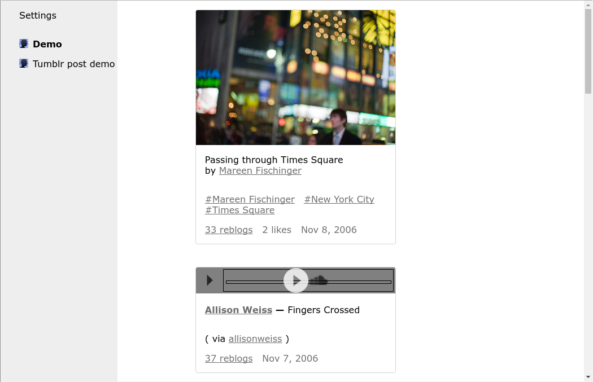
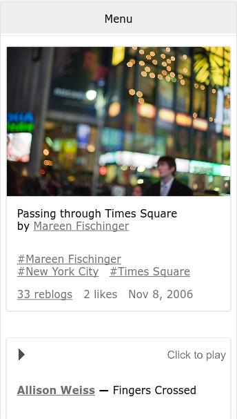

# tumblr-reader
This app is a simple browser based feed reader for tumblr blogs, built on the tumblr api and using angular.

# Screenshots
## Desktop


## Mobile


# Using the app
## Shortcuts
- Next part of post / next post: `n`
- Previous part of post / previous post: `m`


- Next post: `j`
- Previous post: `k`


- Next blog: `shift + j`
- Previous blog: `shift + k`

# Running the app
## Generate a tumblr api key
1. Generate a tumblr api key as described [here](https://www.tumblr.com/docs/en/api/v2#what_you_need).

2. Create a file named `config.json` under `src/assets/config` with the following content (replace placeholders with the
key you just generated):
  ```
  {
    "consumerKey": "Your consumer key here",
    "secretKey": "Your secret key here"
  }
  ```

## Install prerequisites
This project uses the [angular-cli](https://github.com/angular/angular-cli#installation) so you have to install that before continuing.

## Development
To run the app locally for development, clone the repository, install the dependencies with `npm install` and 
start the development server with `ng serve` the app is then available in the browser under `localhost:4200`.

## Production (Apache)
1. Build the app using `ng build --prod` - the generated files will appear in the `dist` directory.

2. Create the directory `tumblr-reader` in the www root of your apache server and place the generated files from 
the `dist` directory there.

3. Enable `AllowOverride` in your apache configuration and place a `.htaccess` file in the `tumblr-reader` directory
with the following content: 

  ```
  <IfModule mod_rewrite.c>
      RewriteEngine On
      RewriteCond %{REQUEST_FILENAME} !-f
      RewriteCond %{REQUEST_FILENAME} !-d
      RewriteRule (.*) index.html [QA,L]
  </IfModule>
  ```

# License
This project is licensed under the MIT license. See the LICENSE file for details.
